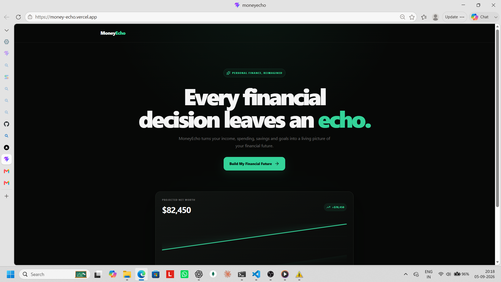
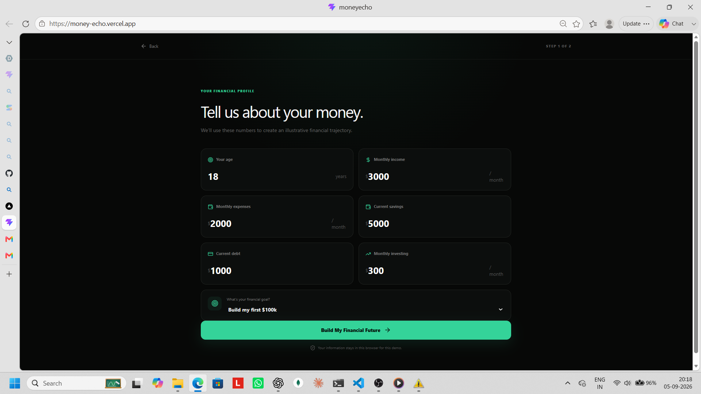
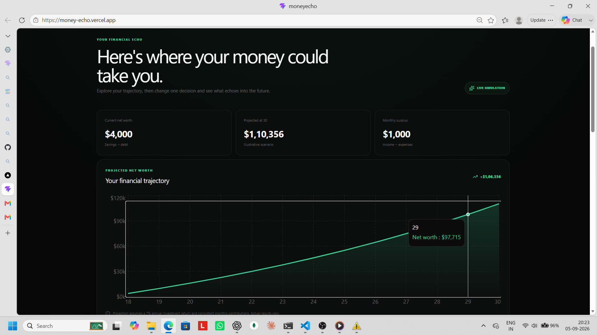
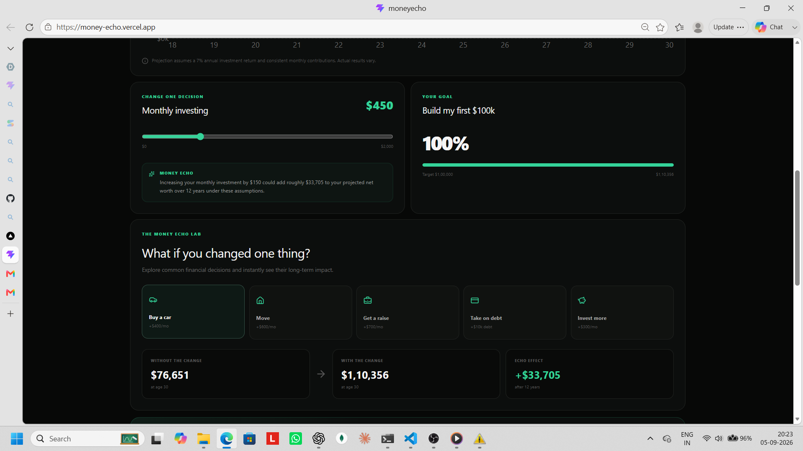
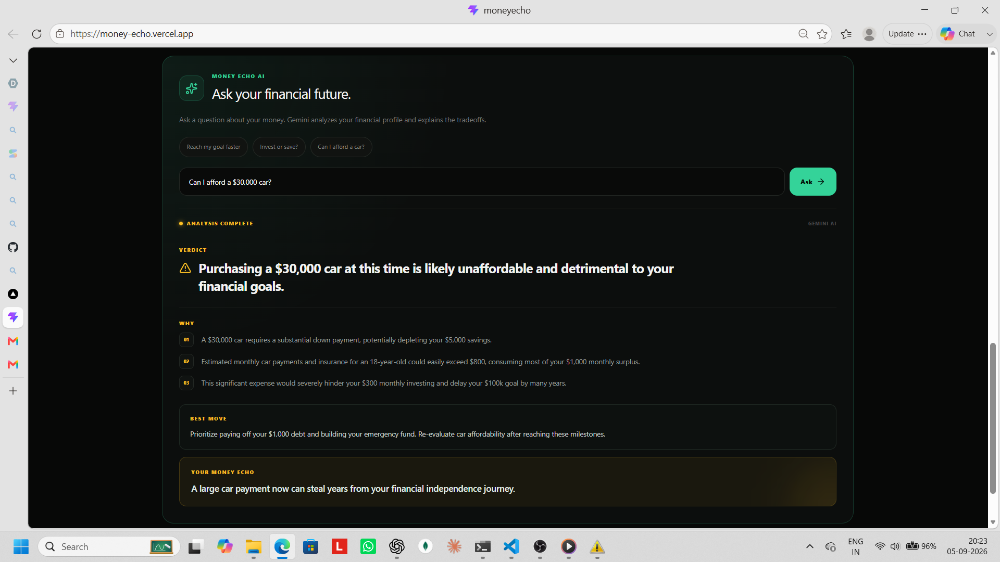

# MoneyEcho

> Every financial decision leaves an echo.

MoneyEcho is an AI-powered financial simulator that helps users understand how today's financial decisions could affect their financial future.

## 🚀 Live Demo

https://money-echo.vercel.app/


## 📸 Screenshots

### 1. Landing Page

The MoneyEcho landing page introduces the core idea: every financial decision leaves an echo.



### 2. Financial Profile

Users enter their age, income, expenses, savings, debt, monthly investing, and financial goal to create their personalized financial profile.



### 3. Financial Dashboard & Tracker

The dashboard visualizes projected net worth, goal progress, monthly investing, and different financial scenarios through the Money Echo Lab.





### 4. AI Financial Coach

Users can ask Gemini questions about their financial decisions and receive a concise verdict, reasoning, recommended action, and long-term financial echo.


## 💡 What is MoneyEcho?

Most personal finance apps show users what happened to their money.

MoneyEcho shows users **what could happen next**.

Users enter their financial information and get an illustrative future projection. They can then change a financial decision and instantly see how that choice could affect their projected net worth.

## ✨ Features

- Personal financial profile
- 12-year net-worth projection
- Interactive investment simulator
- Financial goal tracking
- Money Echo Lab for "what-if" scenarios
- Buy-a-car simulation
- Moving-cost simulation
- Raise simulation
- Debt simulation
- Increased-investment simulation
- Gemini AI financial coach
- Positive, neutral, and warning AI signals
- Responsive dark fintech interface

## 🤖 AI Financial Coach

MoneyEcho uses **Google Gemini** to help users understand financial tradeoffs.

Example questions:

- Can I afford a $30,000 car?
- Should I invest more or save more?
- How can I reach my first $100k faster?

The AI response is organized into:

**Verdict → Why → Best Move → Your Money Echo**

This makes the response easier to understand than a traditional chatbot conversation.

## 📊 Financial Simulation

MoneyEcho uses an illustrative monthly compounding model.

The projection uses a 7% annual investment-return assumption and considers the user's available monthly surplus.

The purpose is to show the potential long-term impact of decisions, not to predict actual investment performance.

## 🛠️ Built With

- React
- Vite
- JavaScript
- Tailwind-CSS
- Node.js
- Express
- Google-Gemini-API
- Generative-AI
- Recharts
- Lucide-React

## 🔄 How It Works

```text
Create Profile
      ↓
See Financial Projection
      ↓
Change One Decision
      ↓
See The Financial Echo
      ↓
Ask Gemini AI
      ↓
Make A Better Decision
```

## Business Potential & Market Advantage

### How It Can Make Money

MoneyEcho can use a **freemium model**. The basic simulator can be free, while premium features can include advanced AI coaching, detailed financial plans, unlimited scenarios, and advanced simulations.

### Why It's Unique

Most finance apps focus on **tracking the past**. MoneyEcho focuses on **understanding the future**.

Users can change a financial decision and instantly see its potential long-term impact.

**Decision → Simulation → Impact → Better Decision**

### Our Market Advantage

- **Simple:** Easy-to-understand financial insights.
- **Interactive:** Users can experiment with real-life financial decisions.
- **Personalized:** AI uses the user's financial profile.
- **Action-focused:** Helps users understand what to do next.
- **Expandable:** Can grow into savings, debt, investing, and financial planning.

MoneyEcho aims to become a **financial decision engine** that helps people understand the potential consequences of their choices before making them.
